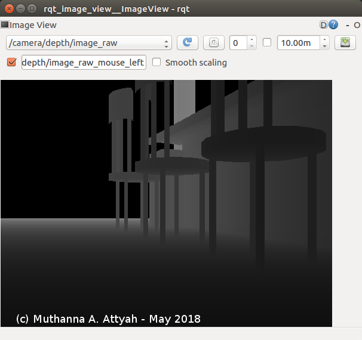

# RoboND_RTAB_SLAM
Create a 2D occupancy grid and 3D octomap from a provided ROS simulated environment using RTAB Slam


## Install
To install `rtabmap_ros`

```bash
$ apt-get udpate
$ sudo apt-get install ros-kinetic-rtabmap ros-kinetic-rtabmap-ros
```

## Robot Model

<p align="center">  </p>

## Launching

### 1- Launch the gazebo world and your robot.

Empty World:
```bash
$ roslaunch slam_project empty_world.launch
```

Kitchen World:
```bash
$ roslaunch slam_project kitchen_world.launch
```

Personal World:
```bash
$ roslaunch slam_project personal_world.launch
```

### 2- Launch your teleop node.
```bash
$ roslaunch slam_project teleop.launch
```

### 3- Launch your mapping node.
```bash
$ roslaunch slam_project mapping.launch
```

or for localization:

```bash
$ roslaunch slam_project localization.launch
```

### 4- Launch Rviz.
```bash
$ roslaunch slam_project rviz.launch
```
## Debugging:

### Debugging with Transform Frames

The `tf` library allows you to debug your coordinate frames (or the tf tree) in several ways. `view_frames` will create a graphical representation of that tree, providing you with a broad view of how different frames (or links) in your setup connect to each other.

```bash
$ rosrun tf view_frames
```
The above will create a PDF file that will depict your tf tree as shown below.

<p align="center">  </p>

The `tf` library also allows you to dynamically collect and display information between two transforms using `tf_monitor`.

```bash
$ rosrun tf tf_monitor frame_1 frame_2
```

### ROSWTF

Another debugging tool under the `tf` library that is useful for debugging your setup is `roswtf`. To see the ROS graph run the following command:

```bash
$ rqt_graph
```
<p align="center">  </p>

`roswtf` will examine and analyze the setup or the graph above, including any running nodes and environment variables, and warn you about any potential issues or errors.

```bash
$ roswtf
```
Sample output is as following:

```text
$ roswtf
Loaded plugin tf.tfwtf
No package or stack in context
================================================================================
Static checks summary:

Found 1 warning(s).
Warnings are things that may be just fine, but are sometimes at fault

WARNING ROS_HOSTNAME may be incorrect: ROS_HOSTNAME [MuthDT2] resolves to [127.0.1.1], which does not appear to be a local IP address ['127.0.0.1', '192.168.1.117', '172.17.0.1'].

================================================================================
Beginning tests of your ROS graph. These may take awhile...
analyzing graph...
... done analyzing graph
running graph rules...
... done running graph rules
running tf checks, this will take a second...
... tf checks complete

Online checks summary:

Found 2 warning(s).
Warnings are things that may be just fine, but are sometimes at fault

WARNING The following node subscriptions are unconnected:
 * /rtabmap/rtabmap:
   * /rtabmap/user_data_async
   * /rtabmap/initialpose
   * /rtabmap/goal
   * /rtabmap/move_base/status
   * /rtabmap/global_pose
   * /rtabmap/goal_node
   * /rtabmap/move_base/feedback
   * /rtabmap/move_base/result
 * /gazebo:
   * /gazebo/set_link_state
   * /gazebo/set_model_state
 * /rviz:
   * /move_base/global_costmap/costmap_updates
   * /mobile_base/sensors/bumper_pointcloud
   * /move_base/local_costmap/costmap_updates
   * /particlecloud
   * /map_updates
   * /move_base/TrajectoryPlannerROS/local_plan
   * /move_base/local_costmap/costmap
   * /move_base/TrajectoryPlannerROS/global_plan
   * /move_base/global_costmap/costmap

WARNING These nodes have died:
 * urdf_spawner-6

```


### Debugging with rqt_console

'rqt_console' aggregates all of the log messages and allows you to sort them.

```bash
$ rqt_console
```

### Image View using rqt_image_view

`rqt_image_view` is a great tool to visualize images streaming from camera and depth maps from sensors. Use it to make sure you are properly receiving the data you want on its specific topic.

```bash
$ rqt_image_view
```
following is output of rgb image

<p align="center">  </p>

and output of depth image

<p align="center">  </p>


### RTAB Database Analysis

The rtabmap-databaseViewer is a great tool for exploring your database when you are done generating it. It is isolated from ROS and allows for complete analysis of your mapping session. This is how you will check for loop closures, generate 3D maps for viewing, extract images, check feature mapping rich zones, and much more!

```bash
$ rtabmap-databaseViewer ~/.ros/rtabmap.db
```

### Real time mapping visualization

Another tool that you can use is rtabmapviz, which is an additional node for real time visualization of feature mapping, loop closures, and more. It’s not recommended to use this tool while mapping in simulation due to the computing overhead. rtabmapviz is great to deploy on a real robot during live mapping to ensure that you are getting the necessary features to complete loop closures.
