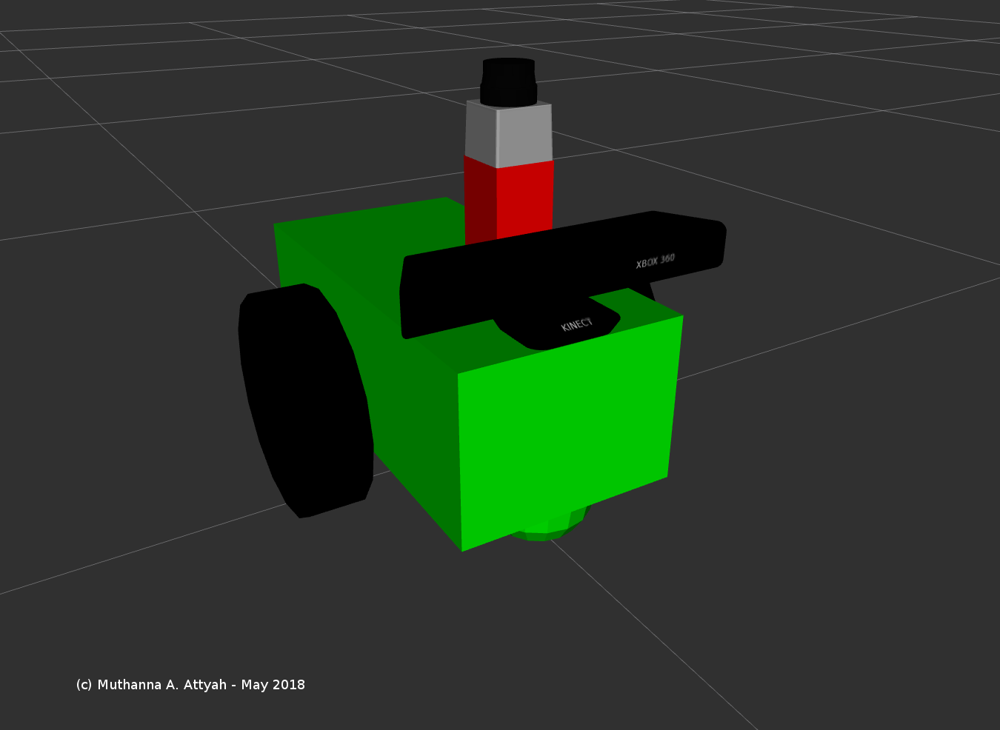

# RoboND_RTAB_SLAM
Create a 2D occupancy grid and 3D octomap from a provided ROS simulated environment using RTAB Slam


## Install
To install `rtabmap_ros`

```bash
$ apt-get udpate
$ sudo apt-get install ros-kinetic-rtabmap ros-kinetic-rtabmap-ros
```

## Robot Model

<p align="center">  </p>

## Launching

### 1- Launch the gazebo world and your robot.

Empty World:
```bash
$ roslaunch slam_project empty_world.launch
```

Kitchen World:
```bash
$ roslaunch slam_project kitchen_world.launch
```

Personal World:
```bash
$ roslaunch slam_project personal_world.launch
```

### 2- Launch your teleop node.
```bash
$ roslaunch slam_project teleop.launch
```

### 3- Launch your mapping node.
```bash
$ roslaunch slam_project mapping.launch
```

or for localization:

```bash
$ roslaunch slam_project localization.launch
```

### 4- Launch Rviz.
```bash
$ roslaunch slam_project rviz.launch
```
## Debugging:

### ROS Graph
To see the ROS graph run the following command:

```bash
$ rqt_graph
```
<p align="center">  </p>

### Debugging with Transform Frames
To generate tf map run the following command:

```bash
$ rosrun tf view_frames
```
The above will create a PDF file that will depict your tf tree as shown below.

<p align="center">  </p>

The tf library also allows you to dynamically collect and display information between two transforms using tf_monitor.

```bash
$ rosrun tf tf_monitor frame_1 frame_2
```

### Image View
To view image from RGB camera and RGB depth Camera:

```bash
$ rqt_image_view
```

Then Select 
